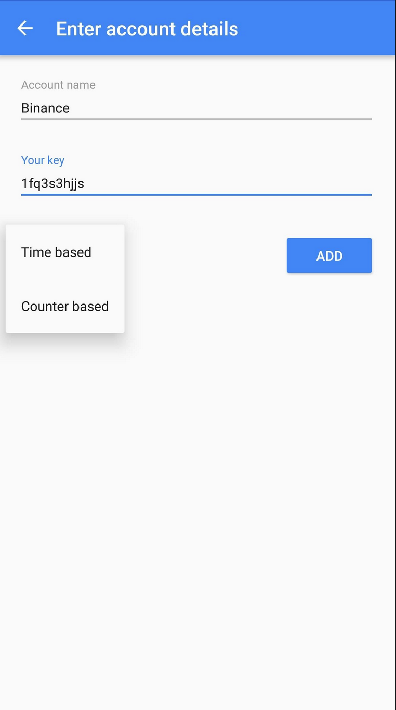

# Authenticator

1. [Overview](#overview)
2. [Scenarios](#scenarios)
3. [Non goals](#non-goals)
4. [Models](#models)
5. [Views](#views)

-------------------

## Overview

Bloom authenticator is a 2fa app. It must be simple to use and secure.

Secrets MUST NOT be stored in cleartext on the devices thus we should use 2 layers of security:
* use an encrypted database to store secrets, like SQLCipher
* store the encryption key (master key) in the OS keyStore (or in shared preference, encrypted by
keystore).

The master key is retrieved only when the app is unlocked (pin or biometric).

Source code: [https://gitlab.com/bloom42/authenticator](https://gitlab.com/bloom42/authenticator)

## Scenarios

## Non goals

* Sync with server

## Models

## Views

### Unlock

  

### Accounts list

A view displaying the list of accounts. We do not display the code here, to prevent mass code retrieval with a screenshot for example.

  

### Add manually

  

### Account code

Display an individual account code, with the possibility to delete the account (MUST display a confirm dialog).

  

### Settings

* switch light/dark theme
* Add / remove pin / biometric
