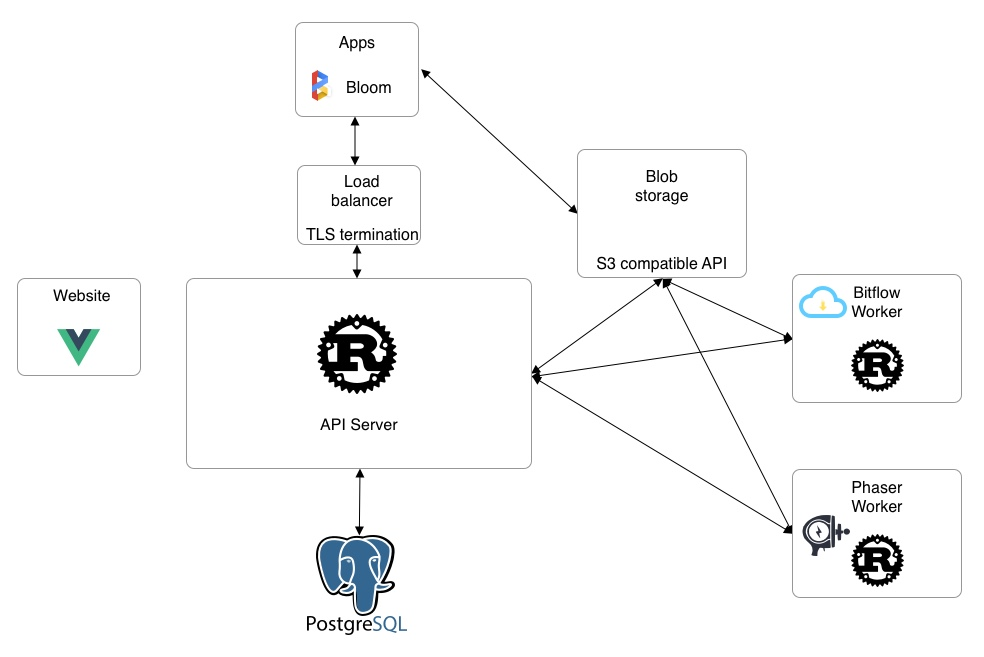

# Architecture

## Infrastructure

## Server architecture

# Actor vs ES

Chaque aggregate est un actor

Reactor aussi

On envoie la commande

Reducer insert en DB

Comment réagir au events ?

On a comme types:

Aggregat
Event
eventData
Command

Reactor

La question c’est: un langage plus simple (et donc plus de contributors, et peut être plus simple a raisonner, et moins ‘erreurs de design)

Ou un langage plus compliqué, donc moins de bugs at scale, et plus de performances (big data)

On construit des projets complexe, on ne va pas rajouter la complexité du langage

Chaque handler handle one command et result un event
-> comment on mutate l’aggregat
-> comment on dispatch ? -> actors qui ecoutent l’event, on le send avec la transaction

# Federation

* https://nl.movim.eu/?node/pubsub.movim.eu/Movim
* https://writefreely.org/
* https://blog.liw.fi/posts/2018/08/30/federated_ci/
* https://github.com/forgefed/forgefed
* https://pixelfed.social/
* https://gitlab.com/gitlab-org/gitlab-ce/issues/4013
* https://news.ycombinator.com/item?id=17171985
* https://news.ycombinator.com/item?id=17153023
* https://news.ycombinator.com/item?id=16734428
* https://news.ycombinator.com/item?id=16667050
* https://www.w3.org/TR/activitypub/
* https://drewdevault.com/2018/07/23/Git-is-already-distributed.html
* https://github.com/tootsuite/mastodon/issues/8122
* https://github.com/Plume-org/Plume
* https://news.ycombinator.com/item?id=19332376
* https://venomousporridge.com/post/30043951343/is-a-federated-twitter-even-possible
* https://medium.com/@EthanZ/mastodon-is-big-in-japan-the-reason-why-is-uncomfortable-684c036498e5
* https://www.libravatar.org/
* https://hackernoon.com/mastodon-is-dead-in-the-water-888c10e8abb1
* https://medium.com/@alex285/from-google-plus-to-facebook-to-twitter-to-mastodon-6a9b0a0cf53a
* https://medium.com/dark-mountain/problems-with-mastodon-7cea23e6bf41
* https://news.ycombinator.com/item?id=20375207
* https://rosenzweig.io/blog/the-federation-fallacy.html
* https://docs.microsoft.com/en-us/azure/architecture/microservices/logging-monitoring
* https://blog.christianposta.com/microservices/the-hardest-part-about-microservices-data/
* https://jack-vanlightly.com/blog/2017/12/28/api-series-part-7-inter-service-communication-overview

your social graph is not portable between platforms.
Your identity should not be coupled with the moderation policy of whichever platform you host your social graph on.

This is why I can’t recommend people follow me at @johnhenry@mastodon.social. If their moderation policy is changed or enforced in a way I don’t like, I lose the valuable, hard-won community I’ve built by later switching to @johnhenry@something.else and having to build my social graph all over again. No-go.

Probleme de la centralisation: data silo, les apps ne peuvent pas échanger de data
Comment se prémunir contre les mauvais acteurs ?

Probleme de la federation: on donne du pouvoir a des acteurs qui, du fait que les information se transportent gratuitement et instantanément, contrairement aux choses physiques, peuvent faire du mal a l’echelle globale (diffusion de contenu incitant a la haine…)

What happens if one node is down, temporary or worse still, permanent?

Le web est feeder mais il manque une chose essentielle: l’identité

Protocoles:
https://webmention.net/
http://activitystrea.ms/
https://activitypub.rocks/
https://matrix.org/docs/spec/

On observe que les gens qui font grossir des communautés le font souvent sur une seul plate-forme et ont du mal

Alternative: centralisation, mais avec une gouvernance open, ainsi on peut éjecter les mauvais acteurs, qu’ils soient étatiques ou non

Comment protéger les utilisateurs des hosts malicieux (vols de mdr, de données personnelles…)?

Your identity should not be coupled with the moderation policy of whichever platform you host your social graph on

I lose the valuable, hard-won community I’ve built by later switching to @johnhenry@something.else and having to build my social graph all over again. No-go.

and many others, and they can all interoperate. This gives the fediverse a scale advantage over the walled garden platforms. This is a point that Jeremy’s article made well:

--------------------

* https://docs.microsoft.com/en-us/azure/architecture/patterns/

## Event sourcing

* https://medium.com/capital-one-tech/event-sourcing-with-aggregates-in-rust-4022af41cf67
* https://medium.com/capital-one-tech/building-an-event-sourcing-crate-for-rust-2c4294eea165
* https://github.com/brendanzab/chronicle
