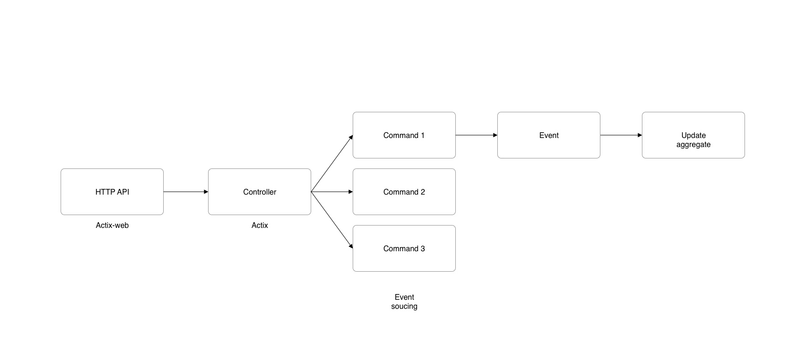
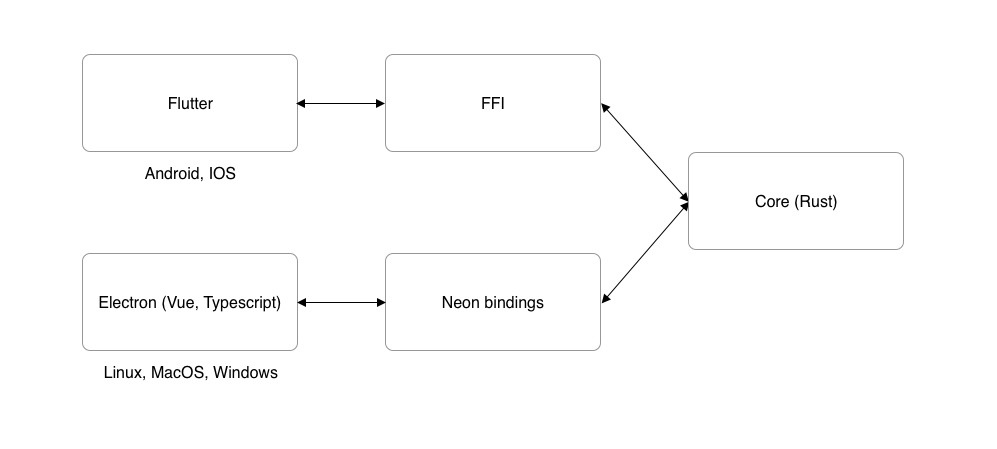

# Architecture


## Infrastructure


## Server




## Apps




### Desktop

Bloom desktop uses [Electron](https://electronjs.org) for the GUI layer.

It communicates between the GUI layer and the core layer using
[Neon bindings](https://neon-bindings.com/docs/intro).


### Mobile

Bloom mobile uses [Flutter](https://flutter.dev) for the GUI layer.

It communicates between the GUI layer and the core layer using
[Dart](https://dart.dev/guides/libraries/c-interop)/[Flutter](https://flutter.dev/docs/development/platform-integration/c-interop) FFI.


### Messages format

```json
{
    "type": "service.my_message",
    "data": {
        // ...
    },
}
```

### Resources

* https://thefullsnack.com/en/string-ffi-rust.html
* https://dev.to/h_ajsf/build-android-app-with-rust-2k92
* https://ghotiphud.github.io/rust/android/cross-compiling/2016/01/06/compiling-rust-to-android.html
* https://github.com/mozilla/rust-android-gradle
* https://github.com/naftulikay/rust-openssl-static-example
* https://doc.rust-lang.org/std/ffi/index.html
* https://thefullsnack.com/en/string-ffi-rust.html
* http://jakegoulding.com/rust-ffi-omnibus/string_arguments/
* https://itnext.io/how-to-call-a-rust-function-from-dart-using-ffi-f48f3ea3af2c
* https://github.com/Sach97/rusty_ffi.dart
* https://neon-bindings.com/docs/electron-apps
* https://developer.android.com/ndk/guides
