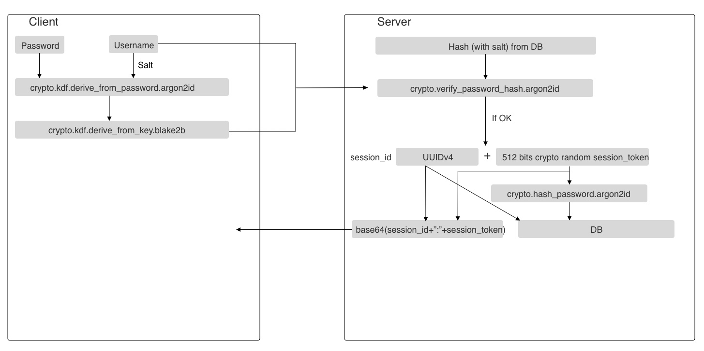

# Security

<!--
Reddit:
Looking for feedback on the cryptographic design of my open source project: Bloom

crypto stack exchange

Hello everyone,

As [stated precedently](previous reddit post link) I'm creating an open source app for end-to-end encrypted
notes, calendar, contacts, files....

I've published the cryptographic details online and I am looking for feedbac by the community before launching it.

Please note that I'm not inventing my own crypto, but rather than combining some primitives in ways that are
generally well appreciated by the crypto community (I've studied almost all end-to-end encrypted app whitepapers and modern cryptography books).

Any feedback is welcome.

Best regards,
Sylvain Kerkour

 -->

If you notice any problem please [open a ticket](https://gitlab.com/bloom42/bloom/-/issues) or email us <a href="mailto:hello@bloom.sh">hello@bloom.sh</a>.


## Table of contents

1. [Introduction](#introduction)
2. [Goals and Threat Model](#goals-and-threat-model)
3. [Overview](#overview)
4. [Authentication](#authentication)
5. [Objects](#objects)
6. [Groups](#groups)
7. [On devices](#on-devices)
8. [In transit](#in-transit)
9. [Backups](#backups)
10. [Resources](#resources)
<!-- 6. [Files](#files) -->


## Introduction

Security is Bloom's *raison d'etre*.

Our primary goals are to put an end on mass surveillance, the assymetry of power between the platforms and the people and the massive data breachs.
All our decisions and arbitrages are made toward these goals.

We approach security with a defense-in-depth mindset. Each layer (technical and organizational) increasing the cost for an attacker to compromise the data.


## Goals and Threat Model

### Principles

**Privacy by Design**: It is impossible to lose, use, or abuse data one doesn’t possess. Therefore we design systems to reduce the amount of sensitive user data we have or can acquire.

**People are part of the system**: If the security of a system depends on people’s behavior, the system must be designed with an understanding of how people behave.

**Getting crypto right is hard**: We should not invent our own cryptography but instead rely on well-known, sound and proven algorithms. Also the code implementing those algorithms should come from renowned cryptographers.

**Simplicity beats everything**: by Keeping It Simple and Stupid (KISS) we reduce the possibilities of introducing errors.

**Symmetric cryptography is a solved problem**: but **key distribution is not**. Thus we avoid as much as possible asymmetric crytography and use symmetric cryptography when possible instead. Also it will help when we will need to move to quantum resistant algorithms.


### Threat Model

General assumptions:
* User's devices are moderately trusted: the filesystem and memory are not trusted but the keystore is.
* Service provider's servers are not trusted regarding confidentiality and integrity but are trusted regarding availability.


The goal is to prevent the server or any adversary (service provider, hackers, cloud provider or a man in-the-middle) from accessing sensitive user data. They must not be able to:
* Access the private content of data
* Modify the data undetected
* Forge data on behalf of an user
* Add or remove a member from a group
* Compromise (execute code on) clients
* `DELETE` data and have these changes synchronized by clients
* `DELETE` database backups

Regarding phone thieves: data is encrypted on the devices withe the key stored in the device's keystore (see the [On devices](#on-devices) section).

<!-- See https://restic.readthedocs.io/en/latest/100_references.html#threat-model -->


### Drawbacks

* We can’t absolutely prevent data loss. If you lose your account's password while none of your device is
logged in, we can’t recover it for you. A recovery key mechanism will be implemented later.


## Overview

* All the crypto code comes from Go's standard library.
* All encryption happen client side.
* Random data is generated using Go's `crypto/rand` as source.
* if `messages` or `objects` can't be authenticated, clients simply ignore them.
* `||` means concatened.
* AD means *Associated Data* (See [AEAD](https://en.wikipedia.org/wiki/Authenticated_encryption))
* tokens are at least 512 bits
* salts are at least 512 bits


### Primitives

**KDF / hashing**: `blake2b` <br />
`blake2b` was chosen because it is widely deployed, no vulnerable to Length extension attacks, fast and has been intensively analyzed since 2008 within the SHA-3 competition.


**PBKDF**: `argon2id` <br />
We use `argon2id` because it provides the good tradeoffs against hardware bruteforece and won the [Password Hashing Competition](https://password-hashing.net/#phc).


**AEAD**: `XChacha20-Poly1305` <br />
`XChacha20-Poly1305` was chosen because it is authenticated, simple, fast on software (and thus less vulnerable to hardware backdoors) widely deployed and has been intensively analyzed (Salsa20, but a proof of ChaCha being at least as secure as Salsa20 was provided). Also, there is no mode to chose (like AES-GCM/CBC-CTR...) so less moving part, so less risk of making a mistake.


**identity / signature**: `Ed25519` <br />
**key exchange**: `X25519` <br />
`Curve25519` was chosen because it is secure, widely deployed, fast, particularly resistant to timing attacks and isn’t the subject of any patent claims.

### Keys

* `user_password` is a password provided by the user (low entropy expected, at least 8 characters required) and that can be changed later.
* `password_key` is a 512 bits key derived from `master_password` (see below how).
* `auth_key` is a 512 bits key derived from `password_key` (see below how).
* `wrap_key` is a 256 bits key derived from `password_key` (see below how).
* `master_key` is a random 256 bits key generated at account creation time and can be updated later. It is used to encrypt all other keys stored on server. It is stored encrypted on server to allow to be sync'ed with other user's devices.
* `identity_key_pair` is the tupple (`public_key`, `private_key`). It's a long-term `Ed25519` key pair
  generated at account creation time and can be updated later. `public_key` is stored plaintext on the server and `private_key` is stored encrypted.
* `username` is an user chosen name. Because we plan to add federation in the future, `usernames` can't be changed. `usernames` are the local-part (i.e. for `hello@bloom.sh` the `username` is `hello`).


## Authentication

The role of authentication is to ensure that an user only receives the encrypted data that they should receive.

* The server **NEVER** sees the plaintext password nor any recoverable form. users must prove that they know their password but that’s not the same thing as revealing it.

### Registration

1. A `display_name` and an `email` is asked to user and sent to server to initiate registration
2. a `verification_code` is sent to `email` and a `verification_code_hash` is stored on server
3. `verification_code` is asked to user and sent to server to be verified
4. `username` and `password` are asked to user
5. A 512 bits key `password_key` is derived from `password` using the PBKDF `argon2id`(salt=`username || "@bloom"`)
6. A 512 bits key `auth_key` is derived from `password_key` using the KDF `blake2b`(key=`password_key`, message=`"com.bloom42.bloom.auth_key" || username || "@bloom"`)
7. A 256 bits key `wrap_key` is derived from `password_key` using the KDF `blake2b`(key=`password_key`, message=`"com.bloom42.bloom.wrap_key" || username || "@bloom"`)
8. An `Ed25519` `identity_key_pair` is generated
9. A 256 bits `master_key` is randomly generated
10. `master_key` is encrypted with `XChaCha20Poly1305`(key=`wrap_key`, AD=`username || "@bloom"`, nonce=random `master_key_nonce`)
11. `private_key` is encrypted with `XChaCha20Poly1305`(key=`master_key`, AD=`username || "@bloom"`, nonce=random `private_key_nonce`)
12. `username` is sent with `auth_key`, `public_key`, `encrypted_private_key`, `private_key_nonce`, `encrypted_master_key` and `master_key_nonce` to the server
13. Server hashes `auth_key` to `auth_key_hash` using `argon2id`(salt=random, keySize=`512 bits`)
14. Server generates a random `UUIDv4` `session_id`, a random 512 bits `session_secret` and a random 512 bits `session_salt`
15. `session_secret_hash` = blake2b(key=`session_secret`, message=`session_id || session_salt`)
16. `session_id`, `session_secret_hash` and `session_salt` are stored in the Database
17. `base64(session_id || session_secret)` is sent back to client to be used as `auth_token`
18. Client saves `auth_token`, `identity_key_pair`, `master_key` fot future use

> Here we choose to not use SRP or OPAQUE because:
> 1) We assume that TLS 1.3 is safe against most attackers
> 2) Even if the attacker obtains the `auth_key` he will just be able to receive encrypted content (as the `wrap_key` is derived from the password)
> 3) It can be easy to mess up by choosing the wrong primes

### Sign in

1. `username` and `password` are asked to user
2. A 512 bits key `password_key` is derived from `password` using the PBKDF `argon2id`(salt=`username || "@bloom"`)
3. A 512 bits key `auth_key` is derived from `password_key` using the KDF `blake2b`(key=`password_key`, message=`"com.bloom42.bloom.auth_key" || username || "@bloom"`)
4. A 256 bits key `wrap_key` is derived from `password_key` using the KDF `blake2b`(key=`password_key`, message=`"com.bloom42.bloom.wrap_key" || username || "@bloom"`)
5. `username` is sent with `auth_key` to server
6. Server verifies that `auth_key` matches stored `auth_key_hash`
7. if 2fa is activated, a `2fa` code is asked
8. Server generates a random `UUIDv4` `session_id`, a random 512 bits `session_secret` and a random 512 bits `session_salt`
9. `session_secret_hash` = blake2b(key=`session_secret`, message=`session_id || session_salt`)
10. `session_id`, `session_secret_hash` and `session_salt` are stored in the Database
11. `auth_token` = `base64(session_id || session_secret)`
12. `auth_token`, `public_key`, `encrypted_private_key`, `private_key_nonce`, `encrypted_master_key` and `master_key_nonce` are sent from server to client
13. Client decrypts `encrypted_master_key` using `wrap_key` to `master_key`
14. Client decrypts `encrypted_private_key` using `master_key` to `private_key`
15. Client saves `auth_token`, `identity_key_pair`, `master_key` fot future use




### Sign out

1. client sends a `sign_out` message to server
2. sever `DELETE` the current session
3. client remove the local database, `db_key` and all other metadata


### Revoking a session

1. client sends a `revoke_session` message to the server which contain the `session_id` field.
2. sever `DELETE` the session associated with `session_id`
3. server_send a `sign_out` notification to the device
4. device remove the local database, `db_key` and all other metadata


### Changing the Password

The password may be reset in two circumstances: when the user changes his password or when the user forgets his password and  still have access to at least one authenticated device.

**Because of the encryption used to protect the data, resetting the password in Bloom is different
from other, less secure services. The password is used to decrypt the data, and we do not have access to it.
Therefore, a user who have lost his password and none of his devices is connected will lose his data**


1. User asks to change his password
2. a `verification_code` is sent to his email address
3. user enter `verification_code`
4. if 2fa is activated, a `2fa` code is asked
5. if ok, a new `password` is asked
6. A 512 bits key `password_key` is derived from `password` using the PBKDF `argon2id`(salt=`username || "@bloom"`)
7. A 512 bits key `auth_key` is derived from `password_key` using the KDF `blake2b`(key=`password_key`, message=`"com.bloom42.bloom.auth_key" || username || "@bloom"`)
8. A 256 bits key `wrap_key` is derived from `password_key` using the KDF `blake2b`(key=`password_key`, message=`"com.bloom42.bloom.wrap_key" || username || "@bloom"`)
9. `master_key` is encrypted with `XChaCha20Poly1305`(key=`wrap_key`, AD=`username || "@bloom"`, nonce=random `master_key_nonce`)
7. `auth_key`, `encrypted_master_key` and `master_key_nonce` are sent to the server
8. Server hashes `auth_key` to `auth_key_hash` using `argon2id` with a random `salt`
9. Server generates a random `UUIDv4` `session_id`, a random 512 bits `session_secret` and a random 512 bits `session_salt`
10. `session_secret_hash` = blake2b(key=`session_secret`, message=`session_id || session_salt`)
11. `session_id`, `session_secret_hash`, `session_salt` and `auth_key_hash` are stored in the Database
12. `base64(session_id || session_secret)` is sent back to client to be used as `auth_token`
13. server revoke all other sessions and send a notification to other devices to sign out
14. Client saves `auth_token` fot future use


> The other devices already have a local copy of `private_key` and `master_key` so we don't really *need*
> to logout them but we do it nonetheless because if a user changes his password it may be because
> his account has been compromised.


### Changing keys

If an user has reasons to believe that his keys have been compromised, he can change them.

This operation generate both a new `identity_keypair` and a new `master_key`.

1. client synchronizes to latest state
2. client fetchs all `objects` keys
3. client generates a new `Ed25519` `identity_key_pair` and a new random `master_key`
4. `master_key` is encrypted with `XChaCha20Poly1305`(key=`wrap_key`, AD=`username || "@bloom"`, nonce=random `master_key_nonce`)
5. `private_key` is encrypted with `XChaCha20Poly1305`(key=`master_key`, AD=`username || "@bloom"`, nonce=random `private_key_nonce`
6. client encrypts all the `object` keys with `master_key` and random nonces
7. `master_key` is encrypted with `XChaCha20Poly1305`(key=`wrap_key`, AD=`username || "@bloom"`, nonce=random `master_key_nonce`)
8. `private_key` is encrypted with `XChaCha20Poly1305`(key=`master_key`, AD=`username || "@bloom"`, nonce=random `private_key_nonce`)
8. client sends to server all the new encrypted `object` keys alongside `public_key`, `encrypted_private_key`, `private_key_nonce`, `encrypted_master_key` and `master_key_nonce`
9. server revokes all other sessions and ask (with a notification) other devices to sign out
10. server `DELETE`s all `group_invitations` for or from the user
11. Client saves `identity_key_pair`, `master_key` fot future use


## Objects

`objects` are `Notes`, `CalendarEvents`, `Contacts`, `QRCodes` and so on...

To learn how `Objects` are synchronized across devices and users in groups, see the
[synchronization](synchronization) page.

For the server they are encrypted and indistinguishable.

`objects` are only encrypted when synchronizing and sent to the server. They are stored in plaintext on the devices
(but in an encrypted database, see below).

`object_ids` are immutable and are generated locally, thus we should avoid the risk of collision. `object_id` is unique within a server.

1. `object_id` is generated using `blake2b`(key=`username`, message=random 512 bits, size=512 bits)
2. `object` is compressed and encrypted locally with `XChaCha20Poly1305`(key=random `object_key`, AD=`object_id || username || "@bloom"`, nonce=random `object_nonce`).
3. `object_key` is encrypted with `XChaCha20Poly1305`(key=`master_key`, AD=`object_id || username || "@bloom"`, nonce=`blake2b`(key=`object_nonce`, message=`object_id`)) to produce `encrypted_object_key`
4. Object is sent to server with its `encrypted_object_key`, `object_nonce`, `object_key_signature` and an `algorithm` field of the form `zstd+xchacha20-poly1305` indicating the compression and the encryption algorithms used

<!--
1. le plus simple serait de chiffrer les `ObjectKey` avec la `PrivateKey`, et de chiffrer la `PrivateKey`
  avec la `PassKey`.
  Ici on doit rekey a chaque changement de la `identity_key_pair`
  ca permet de pouvoir chiffrer des objets juste avec la `PublicKey` d'un user (bitflow...)
2. les `ObjectKey` sont chiffrees directement avec la `PassKey`.
  Ici on doit rekey a chaque changement de password
3. les `ObjectKey` sont chifrees avec une `MasterKey` elle meme chifree avec la `PassKey`.
  Ici on a pas besoin de rekey, mais on ne peut pas le faire quand si la `MasterKey` est compromise.
en theorie on aurait besoin de signer que les `ObjectKey`, vu qu'on utilise un cipher AEAD


### Data types

#### Server DB

```go
type EncryptedObject struct {
  id UUID!
  // ...
  cipher string
  encryptedKey []byte
  nonce []byte
  data []byte

  user_id UUID
  group_id UUID
}
```

#### API

```graphql
type Object {
  id: Uuid!
  cipher: String
  encryptedKey: BYTES
  nonce: BYTES
  encryptedData: BYTES
  // ...
}

type Changes {
  oldState: String!
  newState: String!
  hasMoreChanges: Boolean!
  objects: ObjectEdge
}

type Query {
  changes(sinceState: String): Changes
}

type Mutation {
  sync(): Sync
}
```
#### Local

```go
// this is the `encryptedData` field once decrypted and JSON parsed
type Object struct {
  type string // the decrypted object type ex 'com.bloom42.bloom.note'
  data ANY // the actual object
  // ...
}
```


les besoins:
- verify contact
- automatically add contact on interaction
- group color (unified across apps, for user)

pour les groupes, elle est generee aleatoirement, puis chifree. Lors d'une invitation dans un groupe,
la key est chifree avec la cle publique de l'utilisateur invité, et mise dans l'invitation.

Si l'utilisateur accepte l'invitation, il recoit la clé et peut la dechiffrer en local


le probleme, c'est que la c'est gere cote serveur

 -->


<!--
## Files

TODO

### Resources

* https://tresorit.com/security/encryption

 -->


## Groups


In the following section we will use *alice* and *bob* as 2 users wanting to share data. This is the purpose of groups. Groups allow users to share data without sharing their own `prviate_key` and `master_key`.

Groups are identified as a `group_id` which is an `UUIDv4` that can be used as an username when required to encrypt or verify (as AD for example).

Groups, like users, have a random `master_key`, but they do not have an `identity_keypair`.


### Creation

1. Alices ask to server to create by sending the details (name, description...)
2. server creates a `group` with the details and a `UUIDv4` as `group_id`
3. `group_id` is sent to alice
4. alice generates a random 256 bits `master_key`
5. alice encrypts the `master_key` with `XChaCha20Poly1305`(key=`user_master_key`, AD=`group_id || "@bloom"`, nonce=random `master_key_nonce`)
6. alice sends `encrypted_master_key` and `master_key_nonce` to server
7. server creates alice's group membership and adds those data to alice's group membership


### Invitations

Inviting is the process of adding user's in a group

1. alice fetches bob's `public_key`
2. alice generates an `ephemeral_key_pair`
3. alice encrypts group's `master_key` with bob's `public_key` and the `ephemeral_private_key` to produce `encrypted_master_key`
4. alice destroys `ephemeral_private_key`
5. alice signs the `group_id || bob_username || bob_public_key || ephemeral_public_key || encrypted_master` with her `private_key` to produce `signature`
7. alice sends `encrypted_master_key`, `signature` and `ephemeral_public_key` to server
8. server sends to bob the invitation with the `group_id`,`encrypted_invitation_token`, `invitation_signature`, `ephemeral_public_key` and `encrypted_master_key`
9. bob fetches alice's `public_key`, verifies that the signature matches the `group_id || bob_username || bob_public_key || ephemeral_public_key || encrypted_master` and then accepts the invitation.
11. bob decrypts `encrypted_master` using his `private_key` and start sync'ing the data.

<!-- 8. server generates a random `invitation_token`, encrypts it with bob's public key to produce `encrypted_invitation_token`, hashes it to produce `invitation_token_hash`= `argon2id`(password=`invitation_token`, salt=random 512bits, keySize=`512 bits`)
10. server verifies that bob's `invitation_token` matches his `invitation_token_hash` and sends the `encrypted_master_key` to bob.
-->


> Here we implement only partial forward secrecy. We could improve the key exchange further and provide perfect forward secrecy like Signal does with [X3DH](https://www.signal.org/docs/specifications/x3dh) using a `bob_signed_prekey` that is often rotated but it adds a lot of complexity for limited practical benefits. So it will be implemented in the future if we feel it's required.

> The system is Trust On First Use (TOFU). Verification is done out-of-band using a QR code containing user's public key


### Revoking Access

When Alice tells Bob a secret and later regrets doing so, she cannot make Bob forget that secret without resorting to brain surgery. We feel that brain surgery is beyond the scope of Bloom,
users should be aware that once a secret has been shared the recipient cannot be forced to forget that secret.

Thus, as of today, revoking access is only a server enforced policy, not cryptographically enforced: group's master key can't be changed.

1. bob clicks on the "quit group" button.
2. He removes all the local data he has about the group
3. he tells the server that he want to quit the group.
4. the server `DELETE` bob's group membership and send a notification to all his devices to quit the group.


## On devices

Also known as *at rest* or *endpoints* security.

Apps can be locked using biometric authentication if the device supports it.

No key should be loaded in memory before biometric authentication succeed.

Data other than files like objects, preferences... are stored in a local database on devices. The database
is [badger](https://github.com/dgraph-io/badger) and has native supoprt for `AES-256-CTR` with checks for integrity.

On first launch a random `db_key` is generated and stored on device's
keystore (see below). This `db_key` is used to encrypt the local database.


### Linux

The Linux implementation depends on the `SecretService` dbus
interface, which is provided by [GNOME Keyring](https://wiki.gnome.org/Projects/GnomeKeyring).


### Android

https://developer.android.com/training/articles/keystore


### macOS & iOS

https://developer.apple.com/documentation/security/keychain_services


## In transit

Connection between clients and servers is encrypted using HTTP/2 with TLS 1.3.

As of today, the certificates are provided by [Let's Encrypt](https://letsencrypt.org).

We follow [Mozilla's](https://wiki.mozilla.org/Security/Server_Side_TLS) and [Filippo Valsorda's](https://blog.gopheracademy.com/advent-2016/exposing-go-on-the-internet) recomendations for choosing the cipher suite.

CipherSuite is as follow:
```
tls.TLS_ECDHE_ECDSA_WITH_AES_256_GCM_SHA384
tls.TLS_ECDHE_ECDSA_WITH_CHACHA20_POLY1305
tls.TLS_ECDHE_ECDSA_WITH_AES_128_GCM_SHA256
```

Non TLS ports are closed (thus clients can't connect using plain HTTP connections).


## Backups

TODO

Backups are planned for a future version.

Basically it will be just a big JSON array containing all the objects which is then compressed and encrypted.

### Option a

backups are encrypted using `wrap_key`

* They are no longer valid when keys are changed.
* They can be imported from another account.


### Options b

backups are encrypted using `master_key`.

* They are no longer valid when keys are changed.
* They can't be imported from another account.


### Option c

backups are encrypted using a specific `password`


## Resources

* https://www.manning.com/books/real-world-cryptography
* https://nostarch.com/seriouscrypto
* https://news.ycombinator.com/item?id=18446278 *(Private by Design: How We Built Firefox Sync)*
* http://unhandledexpression.com/crypto/security/2013/12/20/criterions-for-a-crypto-app.html

<!--
* https://research.checkpoint.com/2019/cryptographic-attacks-a-guide-for-the-perplexed
* https://crypto.stackexchange.com/questions/48136/blake2b-as-a-kdf
* https://libsodium.gitbook.io/doc/key_derivation
* https://blog.filippo.io/the-scrypt-parameters
* https://medium.com/@mpreziuso/password-hashing-pbkdf2-scrypt-bcrypt-and-argon2-e25aaf41598e
* https://medium.com/@harwoeck/password-and-credential-management-in-2018-56f43669d588
* https://blogs.dropbox.com/tech/2016/09/how-dropbox-securely-stores-your-passwords
 -->
